# DESIGN — AI Support KB Readiness Agent

> Product direction: a readiness and reliability tool for evaluating whether a
> support knowledge base is suitable for an AI assistant.

The current implementation combines a bilingual Ask Mode gate, Knowledge Base
Readiness Report, deterministic Markdown/PDF Change Impact Mode, and an optional
three-tab Streamlit demo. The UI is a thin adapter over the existing Python APIs;
optional generative answers remain behind the same deterministic validation path.
Change Impact is rule-based and does not use an LLM for policy analysis.

---

## 1. 問題框定（Problem Framing）

企業導入 AI 客服或知識助理時，風險不只在「demo 能不能回答」，而在：

- 回答錯誤時，能否追溯到實際來源？
- 知識庫沒有足夠依據時，系統能否拒答而不是臆測？
- 文件更新後，哪些既有回答可能失效？
- 證據互相衝突時，系統能否停止自動回答並要求人工複核？

長期產品目標不是再做一個聊天介面，而是建立一套可量測、可追溯的
Knowledge Base Readiness workflow，服務 AI 導入顧問、PM、solution engineer、
客戶成功與 AI 工程團隊。

目前 Ask Mode 提供問答與 eval gate，Audit Mode 將 eval 結果包裝成 readiness
artifacts，Change Impact Mode 則隔離比較新舊 Markdown/PDF policy 並標記可能失效的答案。

---

## Relationship to agent-taskflow

This project inherits the validator-and-human-gated approval philosophy used by
`agent-taskflow`, but it does not inherit that project’s runtime orchestration.
There is no task graph, autonomous tool loop, distributed worker runtime, or agent
scheduler in the Ask, Audit, or Change Impact paths.

The inherited idea is narrower and deliberate: LLM output is an untrusted proposal,
not an answer that is safe merely because a provider returned it. Optional
generative output must cite retrieved `chunk_id` values and pass deterministic
provenance and groundedness checks. The groundedness validator is the release gate:
an allowed proposal can become the final answer; a blocked proposal is retained for
audit but the user receives the safe extractive answer or refusal and a human-review
requirement. High-risk audit and Change Impact results likewise remain review inputs,
not automatic approvals or KB mutations.

---

## 2. Current implementation status

### 已實作

| 能力 | Current implementation |
|---|---|
| Corpus | Markdown corpus；政策內容以中文為主，標題與 retrieval aliases 提供中英雙語線索 |
| Ingestion | 僅讀取 `corpus/*.md`；`compare_docs/` 不進入 Ask Mode index |
| Chunking | 依目前 Markdown 語料的 H2 policy section 切分，共產生 34 chunks |
| Metadata | JSONL 保留 `chunk_id`、`doc`、`section`、`section_zh`、`section_slug`、`page`、`text`；Markdown 的 `page` 為 `null` |
| Lexical retrieval | Python standard-library BM25-style scorer，保留為 fallback 與初始 baseline |
| Dense retrieval | `sentence-transformers/paraphrase-multilingual-MiniLM-L12-v2`，使用 normalized embeddings 與 cosine-equivalent dot product |
| Embedding cache | 依 model name 與 chunk content fingerprint，快取為 `data/index/embeddings/*.npz` |
| Hybrid retrieval | lexical 與 dense 分數各自 min-max normalize，再以固定 0.5 / 0.5 權重合併 |
| Answer behavior | 小型 deterministic non-KB guard 先處理 standalone greeting、thanks、empty input 與 app intro；其他查詢維持預設 extractive：回傳最高排名 chunk 原文，或依檢索門檻與已知 unsupported policy evidence 拒答；optional generative mode 不改變預設路徑 |
| Optional generation | fixed closed-book JSON contract；MiniMax-M3 / OpenAI / Anthropic optional providers；`fake_supported` / `fake_hallucination` deterministic backends |
| Generation validator | 驗證 used/claim chunk IDs、每個 claim 的 citation、retrieval provenance，並重用 deterministic groundedness；blocked output 不會成為 final answer |
| Citations | chunk-level citation：文件、section、section slug、chunk ID、evidence text |
| Groundedness | deterministic checks：citation presence/provenance、numeric claim support、refusal support |
| Conflict hook | 僅針對 query-relevant、同 section 的重複 evidence 值差異發出保守 warning；不掃描全 corpus |
| Bilingual support questions | Eval set 與 demo 包含中文及英文 support questions |
| Eval gate | `eval/run_eval.py` 預設 hybrid，評估 retrieval、refusal、citation coverage、groundedness 與 per-case failures |
| Readiness report | `--write-report` 產生穩定 JSON metrics 與 Markdown report，包含 scope、gate、launch recommendation、failure detail 與 deterministic knowledge gaps |
| Change Impact | Markdown H1/H2 與 PyMuPDF layout section parsing；page metadata；slug、heading similarity、lexical overlap alignment；rule-based risk detection；eval / KB impact mapping；JSON 與 Markdown report |
| Streamlit demo | `app.py` 提供 Ask、Readiness Audit、Change Impact 三個 tabs，直接呼叫既有 Python APIs |
| Tests | ingestion、retrieval、answer reliability、groundedness、audit/report 與 comparison regression tests |

### 尚未實作

以下能力未實作，也不應由目前輸出推論：

- OCR for scanned/image-only PDFs
- full legal analysis 或 legal judgment
- sentence-level citation 或 semantic claim entailment（generative output 只要求 claim-level chunk IDs）
- LLM judge 或 RAGAS evaluation
- Chroma、LlamaIndex、ElasticSearch 或其他外部 vector/search framework
- production BM25 service 或 RRF；目前是自製 BM25-style lexical scoring 與 score fusion
- cross-encoder reranker
- generalized production-grade rate limiting、cost controls 或 provider observability（MiniMax 僅提供 bounded transient retry）
- production authentication / authorization
- full semantic diff 與 full-corpus conflict scanning
- automatic policy update application
- token / cost observability

---

## 3. Current architecture（目前架構）

```mermaid
flowchart LR
    A[corpus/*.md<br/>Chinese-primary] --> B[Markdown heading parser]
    B --> C[H2 section chunks<br/>metadata preserved]
    C --> D[data/index/chunks.jsonl]

    D --> L[Lexical retriever<br/>BM25-style]
    D --> E[Dense retriever<br/>multilingual MiniLM]
    E --> Cache[data/index/embeddings/*.npz]

    L --> H[Hybrid score fusion<br/>min-max + equal weight]
    E --> H

    Q[Question] --> L
    Q --> E
    Q --> H

    L --> R[RetrievalResult list]
    E --> R
    H --> R
    R --> G{score / supported<br/>refusal evidence}
    G -->|answerable| X[Extract top chunk text]
    G -->|insufficient or unsupported| F[Refusal / escalation text]
    G -->|optional generative| P[Context-only prompt +<br/>JSON generation]
    P --> JV[Generation validator]
    JV -->|allowed| GA[Generated final answer]
    JV -->|blocked| F
    X --> Z[AnswerResult + chunk citation]
    F --> Z
    GA --> Z
    Z --> V[Deterministic groundedness<br/>and conflict warning hook]
    V --> Gate[Bilingual Ask Mode eval gate]
    Gate --> Audit[metrics.json +<br/>readiness_report.md]
```



Ask Mode 支援三個可選 backend：`lexical`、`dense`、`hybrid`。為保留初始 lexical
workflow 的相容性，answer CLI 的程式預設仍是 `lexical`；目前建議的使用方式是明確指定
`--retriever hybrid`。

`RetrievalResult` 是三種 backend 的共用結構，包含：

```text
chunk_id, doc, section, section_zh, section_slug,
page, score, retrieval_method, text
```

`AnswerResult` 另包含 question、response type、retriever、answer、refusal/review state、confidence、
citations、retrieved chunks、groundedness、warnings 與 latency。新增欄位為
`answer_mode`、`validator_decision`、optional `generation_trace` 與
`blocked_generated_answer`；舊欄位與預設 extractive 行為維持不變。

---

## 4. 關鍵設計決策與取捨（Key Decisions）

### 4.0 Deterministic non-KB guard

`answer_question` 在 retrieval 前以 normalized exact allowlist 辨識 standalone greeting、
thanks、empty input 與 app-introduction questions。命中時直接回傳固定 capability message，
設為 `response_type=non_kb_chitchat` 與 `groundedness.status=not_applicable`，不讀 index、
不呼叫 provider，且 citations / retrieved chunks 為空。這個 citation exemption 只適用於
固定 non-factual message；guard 不使用 topic keyword exclusion，因此任何 policy、support 或
其他 factual query 都會進入原本 retrieval、groundedness 與 optional generation validator。

### 4.1 中文主語料與雙語 retrieval metadata

政策原文維持中文，避免為了英文檢索而複製或翻譯出第二份可能漂移的 policy。
英文 aliases 是 retrieval metadata，不是新增政策主張。lexical 與 dense backend 都會索引
文件名、section、section slug、aliases 與原文。

### 4.2 Markdown-only、structure-aware chunking

目前 ingestion 僅處理 Markdown。語料以 H2 表示一個政策單位，因此 chunk 邊界直接對齊
section，而不是使用固定 token window 或 overlap。這讓 citation 能精確指回政策 section，
但尚未處理 PDF page layout、表格或跨頁內容。

### 4.3 Lexical baseline 保留為 fallback

lexical backend 使用英文 token 與中文 character bigram，再套用 BM25-style length
normalization 與 IDF scoring。它是輕量、無模型下載需求的初始 baseline，但不是
ElasticSearch BM25，也沒有獨立 inverted-index service。

### 4.4 Multilingual dense retrieval

dense backend 預設使用
`paraphrase-multilingual-MiniLM-L12-v2`。文件與 query embedding 都會 normalize，
排名分數由 dot product 取得。模型可用 CLI `--model` 覆寫。

第一次 dense 或 hybrid query 會建立 corpus embeddings。快取 key 由 model name 與實際
chunk retrieval text 計算；語料或模型名稱改變時會產生新的 `.npz` cache。這個 cache
只涵蓋 corpus embeddings，模型本身仍由 sentence-transformers / Hugging Face 管理。

### 4.5 Hybrid 是建議 backend，但不是 RRF

純 lexical 對精確名詞與數字穩定；純 dense 能處理跨語言與語意相似查詢，但可能把
語意接近、政策意義不同的 section 排在前面。目前 hybrid 對兩組全 corpus scores
分別做 min-max normalization，再以等權平均合併，並以 `chunk_id` deterministic
tie-break。

這是刻意簡單的 deterministic score fusion，不是 Reciprocal Rank Fusion，也沒有
reranker。目前 active eval 顯示 hybrid 保留 lexical baseline 的命中，同時提供 dense
retrieval 路徑，因此目前建議 Ask Mode 使用 hybrid。

### 4.6 Default extractive answer 與拒答

預設 answer path 不呼叫 LLM，也不需要 API key，有兩種結果：

- 可回答：直接回傳最高排名 evidence chunk 的原文。
- 不應回答：當最高分低於 backend-specific threshold，或 top-k 中命中已知
  unsupported policy evidence 時，回傳中英文拒答 / escalation 文字。

目前門檻為 lexical `1.0`、dense `0.2`、hybrid `0.2`。這些值只在目前小型語料與
smoke cases 上驗證，不能視為 production calibration。

### 4.7 Optional generative answer 與 validator

`--mode generative` 是明確 opt-in，且必須選擇 `--llm-provider`。prompt 只包含問題、
固定 closed-book JSON contract 與實際 retrieved chunks，並要求模型不得使用外部知識。
MiniMax-M3 透過 OpenAI-compatible SDK 呼叫，預設 endpoint 為
`https://api.minimax.io/v1`，並關閉 thinking、限制 completion token 數與 transient retry。
OpenAI 使用 Responses API structured JSON；Anthropic 使用 Messages API。三者分別只在
設定對應 API key 時可用，且 SDK import 不影響 no-key path。fake providers 供測試與 demo
使用，不需要網路或憑證。

模型輸出 contract 為 `status`、`answer`、`claims` 與 `missing_evidence`；`status` 只能是
`answered` 或 `insufficient_evidence`。每個 claim 都必須列出至少一個 chunk ID；所有 ID
必須出現在 retrieval result。系統只用 retrieval result 建立 citation，不接受模型生成的
文件 metadata。每個 claim 以自己的 citations 檢查 groundedness，再對整體 answer 重用
`check_groundedness` 檢查 citation provenance 與 numeric/date/time support。

因此 generated JSON 只是一份 untrusted proposal。internal `used_chunk_ids` 由 claims 的
citations 建立；schema 合法不代表可 release。`insufficient_evidence` 只有在 answer 仍是明確
安全拒答時才能通過。deterministic validator 是 blocking gate，不提供 warning-only bypass。

validator 也不允許 generated answer 覆寫既有 extractive refusal。任何檢查失敗時，
`validator_decision=blocked`，generated text 只記錄於 `blocked_generated_answer`，final
`answer` 保留安全的 extractive answer/refusal，並強制 `requires_human_review=true`、
`confidence=low`。MiniMax 的 malformed JSON 同樣轉成 blocked proposal（除非 Python caller
明確指定 fail-fast），保留 raw output 與 parse error，不會直接釋出或取代 fallback。

`fake_supported` 與 `fake_hallucination` 實作相同 structured-output contract，讓 demo 與
regression tests 在沒有 API key、網路波動或 provider nondeterminism 的情況下重現 allow 與
block。特別是 `fake_hallucination` 會產生 unsupported numeric claim，用來證明 release gate
真的阻擋輸出，而不只是記錄警告。

### 4.8 Chunk-level source attribution

answer citation 連回實際 retrieved chunk，包含文件與 section identity。generative JSON
會把答案拆成 claims 並要求 chunk IDs，但 validator 目前只做機械式 provenance 與數字支援
檢查，沒有逐句 semantic entailment 或 sentence-level citation rendering。

---

## 5. Product modes

### Ask Mode — active

已提供 CLI retrieval、預設結構化抽取式 answer、拒答、chunk citation、deterministic
groundedness 與正式 eval gate。optional generation 由相同 retrieval 與 validator 約束。
Audit Mode 仍只評估預設 extractive Ask Mode path，確保 gate 不依賴 API key。

### Audit Mode — active

`eval/run_eval.py --write-report` 把 bilingual evaluation output 產品化成
`data/reports/metrics.json` 與 `data/reports/readiness_report.md`，內容包含 retrieval
coverage、refusal quality、citation/groundedness、deterministic knowledge gaps、failure
details 與 launch recommendation。Streamlit demo 可直接執行並呈現這些 artifacts。

Readiness audit 必須能對 incomplete KB 失敗，否則 gate 只證明測試流程可執行，不能證明
它會阻止不安全的 pilot。`src.degraded` 因此建立隔離、可重現的 degraded fixture：不改動
primary `corpus/`，但移除 refund policy 與部分 Enterprise knowledge。相同 eval gate 必須
對 healthy corpus 回傳 `PASS` / `Internal Pilot Ready`，並對 degraded corpus 回傳
`FAIL` / `Not Ready`。

Degraded report 不只列出 aggregate misses。它從 failed cases 與 evidence metadata 產生具體
knowledge gaps，包括 refund windows、renewal refunds、refund processing、Enterprise SLA
與 Enterprise quote handling，讓 reviewer 能把 gate failure 對應到可補齊的 KB 內容。

### Session memory — active, process-local

`src/session.py` 只保留目前 Python process 內的 turns。對 `What about enterprise
customers?` 這類 underspecified follow-up，它先使用上一輪問題解析出 standalone question，
再把 resolved question 送入正常 retrieval。session 不寫入檔案、資料庫或 embedding index，
也不提供跨 process、跨使用者或 durable memory。

Follow-up resolution 發生在 retrieval 之前，不是 evidence substitute。resolved question 仍
必須通過相同 retrieval threshold、refusal behavior、citation construction 與 groundedness
validation；generative mode 若明確啟用，也仍受 generation validator 阻擋。session memory
不能繞過 retrieval 或 release gate。

### Change Impact Mode — active

`src/document_loader.py` 依副檔名載入 Markdown 或 PDF。Markdown 使用 H1/H2；PDF 使用
PyMuPDF 的 text/layout metadata，移除重複頁首頁尾，以字級與字重識別 section heading，
並保留 title、slug、1-based `page` / `page_end` 與 section text。`src/compare.py` 只消費這個
normalized section schema，先以 slug、再以 normalized heading similarity、最後以 lexical
overlap 做 one-to-one alignment。規則會標記
退款期限、eligibility、manual review、non-refundable scope、例外與 processing time 變更，
並映射到 eval questions 和現有 corpus sections。輸出為 `change_impact.json` 與
`change_impact_report.md`。這不是 LLM semantic diff，也不是法律分析或全 corpus 衝突掃描。

Large-document strategy 是 structure first：先解析文件結構，再 alignment，最後逐 section
比較。完整 PDF 永遠不會被串成單一 prompt/context；目前 Change Impact path 也不呼叫 LLM。
因此 50+ page 文件只增加 normalized sections 數量，不會突破單一 context window，也不會
改變 Ask Mode ingestion、optional generation 或既有 eval/audit gates。

PDF loader 使用 PyMuPDF 取得 text spans、font/layout signals 與 page boundaries，移除重複
header/footer，辨識 section headings，並保留 1-based `page` / `page_end` metadata。比較器只
接收抽取後的 normalized sections，逐 section alignment 與 diff；不做 whole-document prompt
loading，也不把整份 PDF 傳給 generation provider。

---

## 6. Evaluation baseline

### Evaluation scope

`eval/eval_set.jsonl` 共有 25 cases：

- 15 answerable
- 5 unanswerable
- 5 conflict / change-impact cases

目前 Ask Mode gate 只啟用前 20 cases。五個標記
`evaluation_scope: p2_change_impact` 的 conflict cases 仍由 `eval/run_eval.py` 排除；Change
Impact Mode 會把相關 cases 納入可能受影響清單，但不把它們混入 Ask Mode retrieval gate。

每個 active case 會分別執行中文 `question` 與英文 `question_en`。目前 gate 同時評估
retrieval contract 與 deterministic answer checks，不是 LLM semantic judge。

### Metric definitions

- **source_hit@k**：top-k 中至少有一個 result 的 `doc` 位於該 case 的允許
  `source_docs`。
- **section_hit@k**：top-k 中至少有一個 result 的 `section_slug` 等於
  `source_section`。

兩者都是 set-membership retrieval metrics，不是 top-1 accuracy，也不是 answer accuracy。

### Hybrid gate results (`k=3`, 20 active cases)

| Backend | Language | source_hit@3 | section_hit@3 |
|---|---:|---:|---:|
| lexical | Chinese | 20/20 (100%) | 20/20 (100%) |
| lexical | English | 20/20 (100%) | 20/20 (100%) |
| dense | Chinese | 19/20 (95%) | 17/20 (85%) |
| dense | English | 20/20 (100%) | 20/20 (100%) |
| hybrid | Chinese | 20/20 (100%) | 20/20 (100%) |
| hybrid | English | 20/20 (100%) | 20/20 (100%) |

因此目前的 retrieval gate 結論是：hybrid 在中英文 20 個 active cases 上都達到
`source_hit@3 = 20/20` 與 `section_hit@3 = 20/20`。這個結果只適用於目前的小型、人工整理
eval set，不代表 production accuracy。

Answer-level gate 額外得到：

| Language | correct refusal | citation coverage | deterministic groundedness pass |
|---|---:|---:|---:|
| Chinese | 20/20 (100%) | 20/20 (100%) | 20/20 (100%) |
| English | 20/20 (100%) | 20/20 (100%) | 20/20 (100%) |

這些指標不等於 aggregate semantic answer accuracy 或 LLM faithfulness。目前未量測
token usage、per-query cost，也未對 production traffic 校準 confidence 或 latency。

### Regression tests

```bash
python -m unittest discover -s tests -v
```

目前 tests 涵蓋 34-chunk corpus-only ingestion、初始 lexical smoke cases、
multilingual dense result schema、embedding cache reuse、hybrid determinism、structured
answer/JSON contract、groundedness、citation provenance、medical refund refusal，以及
query-scoped conflict warning、metrics schema、P2 scope isolation、readiness recommendation、
report rendering，以及 Markdown/PDF parsing、page metadata、large-document alignment、
refund-window risk、eval impact、KB update 與 Change Impact report generation。
Frozen reviewer baseline 共 49 tests。

---

## 7. Boundaries and roadmap

### Readiness Audit boundary

- Audit 只消費目前 deterministic extractive eval 與 `AnswerResult`，不使用 LLM judge 或 API key。
- Knowledge gaps 由 unanswerable/refusal metadata、refusal reason、evidence section 與 question 決定。
- Report artifact 預設 gitignored；Streamlit 僅包裝既有流程，不加入 RAGAS 或 API-based generation。

### Change Impact boundary

- `compare_docs/` 只由明確的 compare command 載入，不污染 Ask Mode index。
- Markdown 與 text-based PDF 都先轉成 normalized sections；不做 whole-document prompt。
- PDF section 保留 PyMuPDF 提取的 page metadata；comparison 僅逐 section 執行。
- section alignment 與 policy-risk signals 都是 transparent deterministic rules。
- P2 cases 用於 impact mapping，不代表新的 semantic answer-accuracy gate。
- 高風險 changes 要求人工複核；報告只指出 possible answer invalidation。
- 不做 full-corpus scanning、LLM diff 或完整法律衝突判定。
- 不會自動修改 corpus、eval expected answers 或 policy 文件。

### Future scale options

- Chroma 或 ElasticSearch：只在 corpus 規模、持久化或 filtering 需求證明必要時引入。
- production BM25 與 RRF：以 retrieval ablation 證明優於目前 score fusion 後再替換。
- Production generation：以 semantic entailment、rate-limit、cost、latency 與 provider
  failure eval 證明可靠後，再考慮擴大 optional live-provider path。
- Query rewriting、HyDE、GraphRAG 或 RAPTOR：只針對明確 failure modes 引入。
- row-level access、PII controls、audit logs 與持續品質監控。

---

## 8. 已知限制與部署考量（Known Limitations）

- 目前只有 6 份虛構 Markdown 文件與 34 chunks，eval 結果不具統計代表性。
- 英文 aliases 是人工維護；新增 section 時若漏加 alias，lexical English retrieval 可能下降。
- dense Chinese diagnostics 仍有失誤：20 個 active cases 的 `source_hit@3` 為 19/20，
  `section_hit@3` 為 17/20；hybrid 在目前 eval 中補回這些 misses。
- 不同 backend 的 raw scores 不可直接比較；目前 threshold 與 fusion weight 尚未做大規模校準。
- cache fingerprint 包含 model name 與 chunk text，但不包含遠端 model revision 或
  sentence-transformers version。
- Markdown 沒有 page 概念，所以 citation 中的 `page` 為 `null`。
- Session memory 僅限單一 process，沒有 durable、跨 process 或 multi-user conversation
  store；follow-up resolver 只使用上一輪 context，並不是通用對話理解。
- 系統沒有權限控管、PII workflow 或 production deployment hardening。
- Generative validator 能攔截 invalid chunk IDs 與 unsupported numeric/date/time claims，
  但不是完整 semantic faithfulness 或 policy-correctness judge。
- Degraded knowledge gaps 來自 curated eval failures 與 deterministic metadata，不能發現 eval
  set 未涵蓋的所有缺漏。
- PDF loader 只支援有 extractable text 與可辨識 heading layout 的文件；沒有 OCR，且複雜
  table、multi-column 或 ambiguous typography 可能造成 section extraction/alignment errors。
- Change Impact 是 rule-based possible-impact mapping，不是 semantic/legal diff、full-corpus
  conflict scan 或 automatic policy update application。
- 模型與 embedding 計算在本機執行；首次使用預設模型通常需要下載模型檔。系統目前不會把
  support corpus 傳送給 API-based LLM；只有明確選擇 generative MiniMax / OpenAI /
  Anthropic provider 時，retrieved chunks 才會連同問題送往該 provider。

---

## 9. 如何執行（How to Run）

```bash
# 安裝
python -m pip install -r requirements.txt

# 只 ingest corpus/，產生 data/index/chunks.jsonl
python -m src.ingest

# 比較 retrieval backends
python -m src.retrieve "標準月付用戶的退款期限是多久？" --retriever lexical --top-k 3
python -m src.retrieve "標準月付用戶的退款期限是多久？" --retriever dense --top-k 3
python -m src.retrieve "標準月付用戶的退款期限是多久？" --retriever hybrid --top-k 3

# Ask Mode extractive answer / refusal（default；no API key）
python -m src.answer "Can customers get a refund after 90 days for medical reasons?" --retriever hybrid --mode extractive

# Optional generative mode（deterministic fake backend；no API key）
python -m src.answer "客戶如果因為醫療因素，90 天後還可以退款嗎？" --retriever hybrid --mode generative --llm-provider fake_hallucination

# Optional MiniMax-M3 provider（requires MINIMAX_API_KEY）
export MINIMAX_API_KEY="..."
python -m src.answer "標準月付用戶的退款期限是多久？" --retriever hybrid --mode generative --llm-provider minimax

# 中英文 retrieval diagnostics；排除 P2 change-impact cases
python -m eval.run_eval --retriever hybrid --top-k 3

# 產生 data/reports/metrics.json 與 readiness_report.md
python -m eval.run_eval --retriever hybrid --write-report

# 以 Markdown 產生 change_impact.json 與 change_impact_report.md
python -m src.compare --old compare_docs/old_refund_policy.md --new compare_docs/new_refund_policy.md

# 產生並比較 50-page synthetic PDF fixtures
python -m scripts.build_large_pdf_fixture --old compare_docs/large_old_refund_policy.pdf --new compare_docs/large_new_refund_policy.pdf --pages 50
python -m src.compare --old compare_docs/large_old_refund_policy.pdf --new compare_docs/large_new_refund_policy.pdf --write-report

# Optional three-tab demo UI（需先安裝 requirements-ui.txt）
streamlit run app.py

# Regression tests
python -m unittest discover -s tests -v
```

預設 extractive CLI、deterministic tests/eval、fake providers 與 Streamlit 都沒有 API key
設定需求。MiniMax live tests 在缺少 `MINIMAX_API_KEY` 時自動 skip，live 結果只記錄於
`generative_sample_runs.md`，不進入 deterministic 100% baseline table。`.env.example` 只列出
optional real-provider settings，程式不會自動載入 `.env`。Streamlit
application 是 optional demo layer，不改變 retrieval scoring、groundedness、eval metrics
或 Change Impact rules。
