# DESIGN — AI Support KB Readiness Agent

> Product direction: a readiness and reliability tool for evaluating whether an
> enterprise support knowledge base is suitable for an AI assistant.

Day 5 adds deterministic Markdown Change Impact Mode alongside the bilingual
Ask Mode gate and Knowledge Base Readiness Report. These remain CLI workflows;
there is no Streamlit application or LLM-based policy analysis.

---

## 1. 問題框定（Problem Framing）

企業導入 AI 客服或知識助理時，風險不只在「demo 能不能回答」，而在：

- 回答錯誤時，能否追溯到實際來源？
- 知識庫沒有足夠依據時，系統能否拒答而不是臆測？
- 文件更新後，哪些既有回答可能失效？
- 證據互相衝突時，系統能否停止自動回答並要求人工複核？

長期產品目標不是再做一個聊天介面，而是建立一套可量測、可追溯的
Knowledge Base Readiness workflow，服務 AI 導入顧問、PM、solution engineer、
客戶成功與 AI 工程團隊。

目前 Ask Mode 提供問答與 eval gate，Audit Mode 將 eval 結果包裝成 readiness
artifacts，Change Impact Mode 則隔離比較新舊 Markdown policy 並標記可能失效的答案。

---

## 2. Current implementation status（Day 5）

### 已實作

| 能力 | Day 5 實作狀態 |
|---|---|
| Corpus | 中文為主，標題與 retrieval aliases 提供中英雙語線索 |
| Ingestion | 僅讀取 `corpus/*.md`；`compare_docs/` 不進入 Ask Mode index |
| Chunking | 依目前 Markdown 語料的 H2 policy section 切分，共產生 34 chunks |
| Metadata | JSONL 保留 `chunk_id`、`doc`、`section`、`section_zh`、`section_slug`、`page`、`text`；Markdown 的 `page` 為 `null` |
| Lexical retrieval | Python standard-library BM25-style scorer，保留為 fallback 與 Day 1 baseline |
| Dense retrieval | `sentence-transformers/paraphrase-multilingual-MiniLM-L12-v2`，使用 normalized embeddings 與 cosine-equivalent dot product |
| Embedding cache | 依 model name 與 chunk content fingerprint，快取為 `data/index/embeddings/*.npz` |
| Hybrid retrieval | lexical 與 dense 分數各自 min-max normalize，再以固定 0.5 / 0.5 權重合併 |
| Answer behavior | 回傳 `AnswerResult`：最高排名 chunk 的原文，或依檢索門檻與已知 unsupported policy evidence 拒答 |
| Citations | chunk-level citation：文件、section、section slug、chunk ID、evidence text |
| Groundedness | deterministic checks：citation presence/provenance、numeric claim support、refusal support |
| Conflict hook | 僅針對 query-relevant、同 section 的重複 evidence 值差異發出保守 warning；不掃描全 corpus |
| Eval gate | `eval/run_eval.py` 預設 hybrid，評估 retrieval、refusal、citation coverage、groundedness 與 per-case failures |
| Readiness report | `--write-report` 產生穩定 JSON metrics 與 Markdown report，包含 scope、gate、launch recommendation、failure detail 與 deterministic knowledge gaps |
| Change Impact | H1/H2 section parsing；slug、heading similarity、lexical overlap alignment；rule-based risk detection；eval / KB impact mapping；JSON 與 Markdown report |
| Tests | Day 1–4 regression、answer reliability、audit/report 與 Day 5 comparison tests |

### 尚未實作

以下能力不屬於目前 Day 5 完成範圍：

- PDF parsing（PyMuPDF / pdfplumber）
- Chroma、ElasticSearch 或其他外部 vector/search database
- production BM25 service 或 RRF；目前是自製 BM25-style lexical scoring 與 score fusion
- cross-encoder reranker
- API-based LLM answer generation
- sentence-level citations
- Streamlit UI
- full semantic/legal diff 與 full-corpus conflict detection
- token / cost observability

---

## 3. Current architecture（目前架構）

```mermaid
flowchart LR
    A[corpus/*.md<br/>Chinese-primary] --> B[Markdown heading parser]
    B --> C[H2 section chunks<br/>metadata preserved]
    C --> D[data/index/chunks.jsonl]

    D --> L[Lexical retriever<br/>BM25-style]
    D --> E[Dense retriever<br/>multilingual MiniLM]
    E --> Cache[data/index/embeddings/*.npz]

    L --> H[Hybrid score fusion<br/>min-max + equal weight]
    E --> H

    Q[Question] --> L
    Q --> E
    Q --> H

    L --> R[RetrievalResult list]
    E --> R
    H --> R
    R --> G{score / supported<br/>refusal evidence}
    G -->|answerable| X[Extract top chunk text]
    G -->|insufficient or unsupported| F[Refusal / escalation text]
    X --> Z[AnswerResult + chunk citation]
    F --> Z
    Z --> V[Deterministic groundedness<br/>and conflict warning hook]
    V --> Gate[Bilingual Ask Mode eval gate]
    Gate --> Audit[metrics.json +<br/>readiness_report.md]
```



Ask Mode 支援三個可選 backend：`lexical`、`dense`、`hybrid`。為保留 Day 1
相容性，answer CLI 的程式預設仍是 `lexical`；目前建議的使用方式是明確指定
`--retriever hybrid`。

`RetrievalResult` 是三種 backend 的共用結構，包含：

```text
chunk_id, doc, section, section_zh, section_slug,
page, score, retrieval_method, text
```

`AnswerResult` 另包含 question、retriever、answer、refusal/review state、confidence、
citations、retrieved chunks、groundedness、warnings 與 latency。

---

## 4. 關鍵設計決策與取捨（Key Decisions）

### 4.1 中文主語料與雙語 retrieval metadata

政策原文維持中文，避免為了英文檢索而複製或翻譯出第二份可能漂移的 policy。
英文 aliases 是 retrieval metadata，不是新增政策主張。lexical 與 dense backend 都會索引
文件名、section、section slug、aliases 與原文。

### 4.2 Markdown-only、structure-aware chunking

目前 ingestion 僅處理 Markdown。語料以 H2 表示一個政策單位，因此 chunk 邊界直接對齊
section，而不是使用固定 token window 或 overlap。這讓 citation 能精確指回政策 section，
但尚未處理 PDF page layout、表格或跨頁內容。

### 4.3 Lexical baseline 保留為 fallback

lexical backend 使用英文 token 與中文 character bigram，再套用 BM25-style length
normalization 與 IDF scoring。它是輕量、無模型下載需求的 Day 1 baseline，但不是
ElasticSearch BM25，也沒有獨立 inverted-index service。

### 4.4 Multilingual dense retrieval

dense backend 預設使用
`paraphrase-multilingual-MiniLM-L12-v2`。文件與 query embedding 都會 normalize，
排名分數由 dot product 取得。模型可用 CLI `--model` 覆寫。

第一次 dense 或 hybrid query 會建立 corpus embeddings。快取 key 由 model name 與實際
chunk retrieval text 計算；語料或模型名稱改變時會產生新的 `.npz` cache。這個 cache
只涵蓋 corpus embeddings，模型本身仍由 sentence-transformers / Hugging Face 管理。

### 4.5 Hybrid 是建議 backend，但不是 RRF

純 lexical 對精確名詞與數字穩定；純 dense 能處理跨語言與語意相似查詢，但可能把
語意接近、政策意義不同的 section 排在前面。Day 2 hybrid 對兩組全 corpus scores
分別做 min-max normalization，再以等權平均合併，並以 `chunk_id` deterministic
tie-break。

這是刻意簡單的 deterministic score fusion，不是 Reciprocal Rank Fusion，也沒有
reranker。Day 2 active eval 顯示 hybrid 保留 lexical baseline 的命中，同時提供 dense
retrieval 路徑，因此目前建議 Ask Mode 使用 hybrid。

### 4.6 Extractive answer 與拒答

目前沒有 LLM generation。answer path 有兩種結果：

- 可回答：直接回傳最高排名 evidence chunk 的原文。
- 不應回答：當最高分低於 backend-specific threshold，或 top-k 中命中已知
  unsupported policy evidence 時，回傳中英文拒答 / escalation 文字。

目前門檻為 lexical `1.0`、dense `0.2`、hybrid `0.2`。這些值只在目前小型語料與
smoke cases 上驗證，不能視為 production calibration。

### 4.7 Chunk-level source attribution

answer citation 連回實際 retrieved chunk，包含文件與 section identity。這能支援人工查證，
但目前沒有把答案拆成 claims，也沒有逐句驗證或 sentence-level citation。

---

## 5. Product modes：current vs target

### Ask Mode — active

已提供 CLI retrieval、結構化抽取式 answer、拒答、chunk citation、deterministic
groundedness 與正式 eval gate。Audit Mode 只評估並報告這條 Ask Mode path。

### Audit Mode — Day 4 active

`eval/run_eval.py --write-report` 把 bilingual evaluation output 產品化成
`data/reports/metrics.json` 與 `data/reports/readiness_report.md`，內容包含 retrieval
coverage、refusal quality、citation/groundedness、deterministic knowledge gaps、failure
details 與 launch recommendation。目前只有 CLI artifacts，沒有 Streamlit UI。

### Change Impact Mode — Day 5 active

`src/compare.py` 隔離載入兩份 Markdown policy，依 H1/H2 結構解析，先以 slug、再以
normalized heading similarity、最後以 lexical overlap 做 one-to-one alignment。規則會標記
退款期限、eligibility、manual review、non-refundable scope、例外與 processing time 變更，
並映射到 eval questions 和現有 corpus sections。輸出為 `change_impact.json` 與
`change_impact_report.md`。這不是 LLM semantic diff，也不是法律分析或全 corpus 衝突掃描。

---

## 6. Evaluation（Day 4 baseline）

### Evaluation scope

`eval/eval_set.jsonl` 共有 25 cases：

- 15 answerable
- 5 unanswerable
- 5 conflict / change-impact cases

目前 Ask Mode gate 只啟用前 20 cases。五個標記
`evaluation_scope: p2_change_impact` 的 conflict cases 仍由 `eval/run_eval.py` 排除；Change
Impact Mode 會把相關 cases 納入可能受影響清單，但不把它們混入 Ask Mode retrieval gate。

每個 active case 會分別執行中文 `question` 與英文 `question_en`。Day 3 gate 同時評估
retrieval contract 與 deterministic answer checks，不是 LLM semantic judge。

### Metric definitions

- **source_hit@k**：top-k 中至少有一個 result 的 `doc` 位於該 case 的允許
  `source_docs`。
- **section_hit@k**：top-k 中至少有一個 result 的 `section_slug` 等於
  `source_section`。

兩者都是 set-membership retrieval metrics，不是 top-1 accuracy，也不是 answer accuracy。

### Hybrid gate results (`k=3`, 20 active cases)

| Backend | Language | source_hit@3 | section_hit@3 |
|---|---:|---:|---:|
| lexical | Chinese | 20/20 (100%) | 20/20 (100%) |
| lexical | English | 20/20 (100%) | 20/20 (100%) |
| dense | Chinese | 19/20 (95%) | 17/20 (85%) |
| dense | English | 20/20 (100%) | 20/20 (100%) |
| hybrid | Chinese | 20/20 (100%) | 20/20 (100%) |
| hybrid | English | 20/20 (100%) | 20/20 (100%) |

因此目前的 retrieval gate 結論是：hybrid 在中英文 20 個 active cases 上都達到
`source_hit@3 = 20/20` 與 `section_hit@3 = 20/20`。這個結果只適用於目前的小型、人工整理
eval set，不代表 production accuracy。

Answer-level gate 額外得到：

| Language | correct refusal | citation coverage | deterministic groundedness pass |
|---|---:|---:|---:|
| Chinese | 20/20 (100%) | 20/20 (100%) | 20/20 (100%) |
| English | 20/20 (100%) | 20/20 (100%) | 20/20 (100%) |

這些指標不等於 aggregate semantic answer accuracy 或 LLM faithfulness。目前未量測
token usage、per-query cost，也未對 production traffic 校準 confidence 或 latency。

### Regression tests

```bash
python -m unittest discover -s tests -v
```

目前 tests 涵蓋 34-chunk corpus-only ingestion、Day 1 lexical smoke cases、
multilingual dense result schema、embedding cache reuse、hybrid determinism、structured
answer/JSON contract、groundedness、citation provenance、medical refund refusal，以及
query-scoped conflict warning、metrics schema、P2 scope isolation、readiness recommendation、
report rendering，以及 Markdown parsing/alignment、refund-window risk、eval impact、KB update
與 Change Impact report generation。

---

## 7. Boundaries and roadmap

### Day 4 audit boundary

- Audit 只消費目前 deterministic eval 與 `AnswerResult`，不使用 LLM judge。
- Knowledge gaps 由 unanswerable/refusal metadata、refusal reason、evidence section 與 question 決定。
- Report artifact 預設 gitignored；不加入 Streamlit、RAGAS 或 API-based generation。

### Day 5 Change Impact boundary

- `compare_docs/` 只由明確的 compare command 載入，不污染 Ask Mode index。
- section alignment 與 policy-risk signals 都是 transparent deterministic rules。
- P2 cases 用於 impact mapping，不代表新的 semantic answer-accuracy gate。
- 高風險 changes 要求人工複核；報告只指出 possible answer invalidation。
- 不做 full-corpus scanning、LLM diff 或完整法律衝突判定。

### Future scale options

- Chroma 或 ElasticSearch：只在 corpus 規模、持久化或 filtering 需求證明必要時引入。
- production BM25 與 RRF：以 retrieval ablation 證明優於目前 score fusion 後再替換。
- API-based 或 local LLM generation：在 extractive baseline、answer contract 與
  groundedness validator 穩定後評估。
- Query rewriting、HyDE、GraphRAG 或 RAPTOR：只針對明確 failure modes 引入。
- row-level access、PII controls、audit logs 與持續品質監控。

---

## 8. 已知限制與部署考量（Known Limitations）

- 目前只有 6 份虛構 Markdown 文件與 34 chunks，eval 結果不具統計代表性。
- 英文 aliases 是人工維護；新增 section 時若漏加 alias，lexical English retrieval 可能下降。
- dense Chinese diagnostics 仍有失誤：20 個 active cases 的 `source_hit@3` 為 19/20，
  `section_hit@3` 為 17/20；hybrid 在目前 eval 中補回這些 misses。
- 不同 backend 的 raw scores 不可直接比較；目前 threshold 與 fusion weight 尚未做大規模校準。
- cache fingerprint 包含 model name 與 chunk text，但不包含遠端 model revision 或
  sentence-transformers version。
- Markdown 沒有 page 概念，所以 citation 中的 `page` 為 `null`。
- 系統沒有多輪對話記憶、權限控管、PII workflow 或 production deployment hardening。
- 模型與 embedding 計算在本機執行；首次使用預設模型通常需要下載模型檔。系統目前不會把
  support corpus 傳送給 API-based LLM，因為沒有整合這類服務。

---

## 9. 如何執行（How to Run）

```bash
# 安裝
python -m pip install -r requirements.txt

# 只 ingest corpus/，產生 data/index/chunks.jsonl
python -m src.ingest

# 比較 retrieval backends
python -m src.retrieve "標準月付用戶的退款期限是多久？" --retriever lexical --top-k 3
python -m src.retrieve "標準月付用戶的退款期限是多久？" --retriever dense --top-k 3
python -m src.retrieve "標準月付用戶的退款期限是多久？" --retriever hybrid --top-k 3

# Ask Mode extractive answer / refusal
python -m src.answer "Can customers get a refund after 90 days for medical reasons?" --retriever hybrid

# 中英文 retrieval diagnostics；排除 P2 change-impact cases
python -m eval.run_eval --retriever hybrid --top-k 3

# 產生 data/reports/metrics.json 與 readiness_report.md
python -m eval.run_eval --retriever hybrid --write-report

# 產生 change_impact.json 與 change_impact_report.md
python -m src.compare --old compare_docs/old_refund_policy.md --new compare_docs/new_refund_policy.md

# Regression tests
python -m unittest discover -s tests -v
```

目前沒有 `.env` / API key 設定需求，也沒有可啟動的 Streamlit application。
